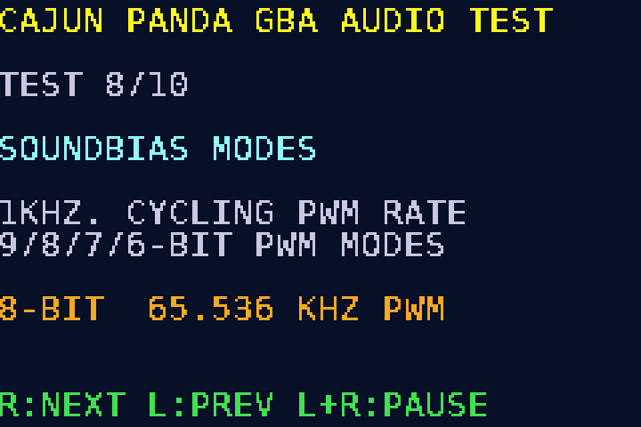
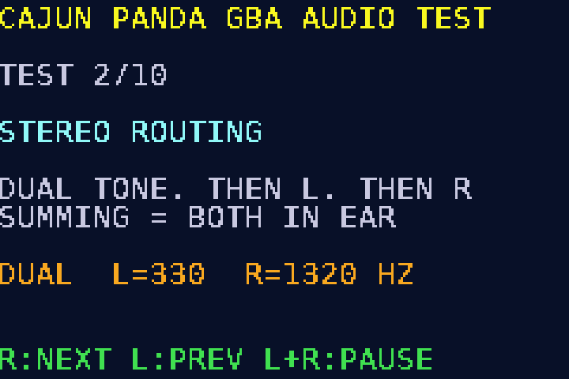
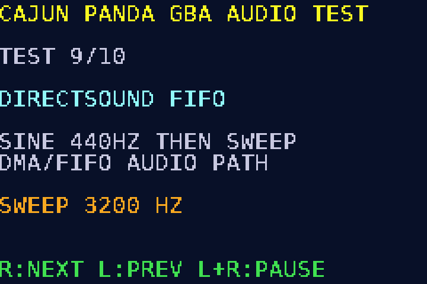

# Cajun Panda's GBA Audio Test ROM

A headless, auto-cycling audio test cartridge for the **Game Boy Advance**. It
exercises the full GBA audio path: stereo routing, frequency response, dynamic
range, the PSG channels, the SOUNDBIAS PWM bit-rate modes, and the DirectSound
FIFO/DMA path. Use it for bringing up audio hardware, mods, repairs, amplifiers,
or anything else that needs a known, repeatable GBA audio signal.

It needs **no screen**. On power-up it plays a boot chime, then auto-cycles
through the tests. Each test is announced by a count of beeps
(**N beeps = test number N**) so you can tell where you are by ear alone.

**If a screen is attached** it also shows a per-test explainer (bitmap Mode 3):
the test number, name, what it exercises, and a live status line (current
frequency, channel, SOUNDBIAS mode, or volume). The display is purely
informational; the audio and timing are identical with or without it.

Input is limited to the **shoulder buttons**, so it works on a bare board with
no face buttons wired.



## Controls

| Input | Action |
|-------|--------|
| **R** | next test |
| **L** | previous test |
| **hold L + R** (~0.7 s) | pause (loops the current test with a short gap) or resume |

## Test sequence

| # | Beeps | Test | What it exercises |
|---|-------|------|-------------------|
| 1 | 1 | **Reference tone**, 1 kHz square, both channels | path is alive, nominal level |
| 2 | 2 | **Stereo**, dual tone (L 330 Hz + R 1320 Hz at once), then Left-only 440 Hz, then Right-only 880 Hz | L/R routing, crosstalk, and channel summing (a summed path plays both dual tones in both ears) |
| 3 | 3 | **Sweep**, stepped 80 Hz to 16 kHz, both channels | bandwidth and high-frequency rolloff |
| 4 | 4 | **Steps**, 100 Hz to 16 kHz discrete tones | per-frequency response |
| 5 | 5 | **Dynamic**, 1 kHz, volume ramp 15 to 0 | low-level linearity, noise floor, quantization |
| 6 | 6 | **Noise**, PSG channel 4 broadband | wideband content, distortion |
| 7 | 7 | **Wave**, PSG channel 3 triangle (~300 Hz) | harmonic-rich waveform, wave-RAM path |
| 8 | 8 | **SOUNDBIAS**, 1 kHz while cycling bit-rate modes | PWM carrier resolution and sampling rate (see below) |
| 9 | 9 | **DirectSound**, FIFO sine 440 Hz then sweep | DMA/FIFO sample-playback path |
| 10 | 10 | **Silence**, all channels off | idle noise-floor measurement window |

After test 10 it wraps back to test 1.

### Test 8: SOUNDBIAS bit-rate modes

The GBA reconstructs sound as a PWM bitstream; `SOUNDBIAS[15:14]` selects the
amplitude resolution and sampling (carrier) frequency. Test 8 holds a steady
1 kHz tone and steps through all four, ~1.7 s each, retriggering the tone at
each change so the four segments are audible:

1. **9-bit / 32.768 kHz** (GBA default, lowest carrier frequency)
2. **8-bit / 65.536 kHz**
3. **7-bit / 131.072 kHz**
4. **6-bit / 262.144 kHz**

Higher modes move the PWM carrier further above the audio band (easier to filter)
at the cost of amplitude resolution. Scope the audio output during this test to
see how much carrier residue each setting leaves.

## Building

The ROM builds with a stock bare-metal ARM toolchain. **devkitARM and devkitPro
are not required.** The code is freestanding (`-nostdlib`), runs ARM code from
ROM, and is division-free at runtime so it links without any ARMv4T libgcc
multilib.

### Prerequisites

| Tool | Needed for | Install (Debian/Ubuntu) |
|------|-----------|--------------------------|
| `arm-none-eabi-gcc` + binutils | building the ROM | `sudo apt install gcc-arm-none-eabi` |
| `make` | the build | `sudo apt install make` |
| `python3` | header checksum fixup (always) | usually preinstalled |
| `python3` + Pillow (PIL) | optional, regenerating the font | `pip install pillow` |

On other platforms, install any GNU `arm-none-eabi` toolchain (e.g. the official
[Arm GNU Toolchain](https://developer.arm.com/downloads/-/arm-gnu-toolchain-downloads))
and make sure `arm-none-eabi-gcc` is on your `PATH`. To use a differently-named
toolchain prefix, override it: `make PREFIX=arm-none-eabi-`.

### Build

```bash
make            # produces gba-audio-test.gba
make clean      # remove build artifacts
```

The build links the ELF, extracts a raw binary with `objcopy`, then runs
`tools/gbafix.py` to patch the header complement check so the ROM boots on real
hardware. The required Nintendo boot logo is embedded in `src/crt0.s` (it is part
of every GBA cartridge header and is needed for the BIOS to boot the cart).

### Generated sources (committed)

`src/sintab.h` (DirectSound sine table) and `src/font.h` (the on-screen font,
rasterized from DejaVu Sans Mono) are checked in so the default build needs no
extra tools. Regenerate them only if you want to change them:

```bash
python3 - <<'PY' > src/sintab.h
import math
N=256; A=100
print("#ifndef SINTAB_H\n#define SINTAB_H")
print("static const signed char sintab[%d] = {"%N)
print(",".join(str(int(round(A*math.sin(2*math.pi*i/N)))) for i in range(N)))
print("};\n#endif")
PY

python3 tools/gen_font.py          # needs Pillow; rewrites src/font.h
```

## Running in an emulator

```bash
make run        # launches mGBA with the ROM (listen to the audio)
```

Any GBA emulator works; the Makefile's `run` target uses `mgba-qt`.

## Flashing to a cartridge

Write `gba-audio-test.gba` to any GBA flash cart using your preferred flasher.
With a [FlashGBX](https://github.com/Lesserkuma/FlashGBX)-supported writer
(GBxCart RW, GBFlash, etc.):

```bash
flashgbx        # GUI: AGB/GBA mode, "Write ROM", choose gba-audio-test.gba
```

Or via the FlashGBX CLI:

```bash
flashgbx --cli --mode agb --action flash-rom gba-audio-test.gba
```

Pick the cart type that matches your flash cart's flash chip when prompted.

## On-screen display

When a screen is connected, each test draws an explainer in bitmap Mode 3:
header, `TEST n/10`, the test name, two explainer lines, a live status line, and
the control hint. A `PAUSED` indicator appears at the right of the `TEST n/10`
line when paused.

| Stereo | DirectSound |
|--------|-------------|
|  |  |

The screen drawing in `src/screen.c` can be rendered on a host PC (no GBA needed)
to check layout:

```bash
gcc -DSCREEN_HOST -I. tools/screen_host.c src/screen.c -o /tmp/shost
/tmp/shost 7 "8-BIT  65.536 KHZ PWM"   # renders test 8 to /tmp/screen.ppm
```

## How it works

- All timing is frame-driven by polling `VCOUNT` (~59.7 Hz); no interrupts are used.
- Tones come from the four PSG channels (square, wave, noise) routed via
  `SOUNDCNT_L`; the DirectSound test feeds a generated sine through a Timer0 +
  DMA1 FIFO with a phase-continuous per-frame buffer refill.
- Runtime code avoids integer division so it needs no libgcc helpers.
- Audio level: PSG tests run channel/master volume near max; the DirectSound
  sine is generated at ±100/128 full scale to leave a little headroom.

## Project layout

```
Makefile            build (stock arm-none-eabi-gcc)
gba.ld              linker script (code in ROM, data/bss in IWRAM)
src/crt0.s          cartridge header + Nintendo logo + startup
src/gba.h           register definitions
src/main.c          test framework and all tests
src/screen.c/.h     optional Mode 3 on-screen explainer
src/sintab.h        generated sine table (DirectSound)
src/font.h          generated 8x12 bitmap font
tools/gbafix.py     header complement-check fixer (post-link)
tools/gen_font.py   font generator (optional; needs Pillow)
tools/screen_host.c host renderer for screen-layout checks
```

## License

MIT. See [LICENSE](LICENSE).

The Nintendo boot logo embedded in the cartridge header is a required part of
every GBA ROM and is property of Nintendo; it is not covered by this project's
license.
